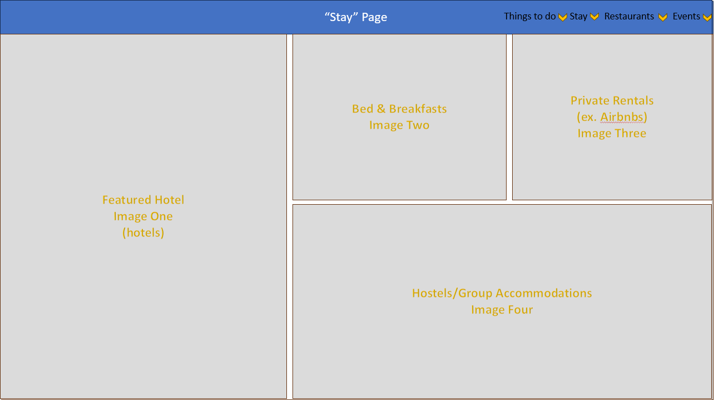
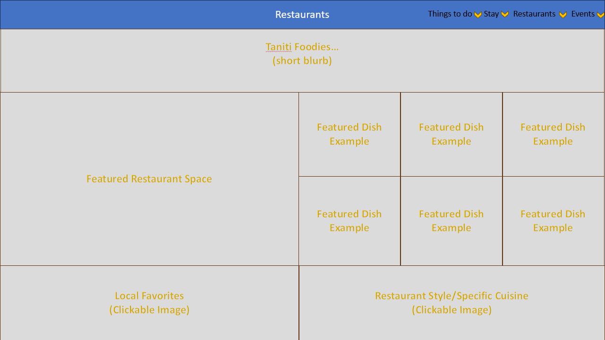

# Low Fidelity Wireframe

> C. Create a low-fidelity wireframe showing the suggested flow of your new design for the Tanitian website.

## Desktop Version

### Homepage

The homepage for many tourism sites features the following:

- Floating navbar at the top that remains in place as a user scrolls down the page
- A looping video or image that encompasses the viewport height/width on the landing page, but can be scrolled past to further content on the homepage that links to other sections of the site.
- Navigation links for Things To Do, Places To Go, Food To Eat. Most tourism sites I checked had some version of these three pages on their site, to show visitors events or attractions in the area, the type of food and restaurants one might find there, and scenic locations to draw the eye.

### Stay Page

The Stay page of the site shows visitors the kinds of accommodations that can be found in Taniti, depending on what kind of accommodation they are looking for.
The following categories are represented:

- Hotels
- Bed & Breakfasts
- Private Rentals (ex. Airbnbs, Condos etc)
- Hostels (for larger group accommodations)

### Restaurants Page

The Restaurants page shows users what kind of restaurants and dining options are available in Taniti during their stay.
This first page has a large feature card for a specific restaurant, as well as six "Featured Dish Example" images for that feature restaurant as a highlight of the page.
Further down the page, there are clickable images that would allow users to find Local Favorites, or a specific type of restaurant or cuisine.

## Mobile Design

### Homepage

The mobile homepage wireframe is intended to give a representation of the mobile responsiveness of the site. As the site would be primarily grid-based, in general, most content would simply be pushed into a singular column, with navigation that is friendlier to a mobile user such as a drop-down hamburger menu.

### Navigation Bar Drop-down

Upon expanding the hamburger menu, a full-viewport navigation menu will open up for the user with clickable links for the main pages of the site. Upon clicking each of the headings, if there are sub-sections of that site, more options will drop down into the menu to be selected. A search bar for mobile is also shown at the top.

## Sources & Citations

I looked at several tourism websites to get ideas for what a tourism website typically looks like, but I took the greatest inspiration from the two below:

[Visit Tampa Bay](https://www.visittampabay.com/)
[Visit California](https://www.visitcalifornia.com/)
[Go Hawaii](https://www.gohawaii.com/)
